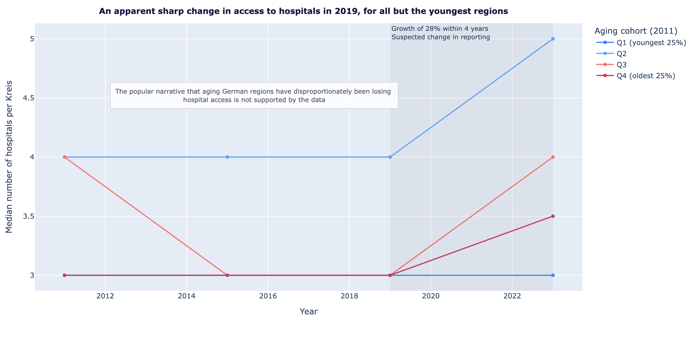
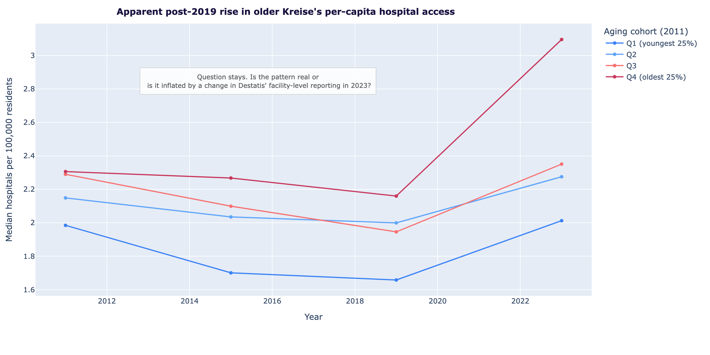

# German Hospitals — Data Project

A data project looking at German hospitals from 2010 to today, with the
goal of illustrating the trends for hospitals in the regions (Kreises) where population is ageing and on the opposite, where the population is getting younger.

## The context
In 2025, Germany has initialised a hospital reform. The goal is to alleviate the financial pressure on hospitals, and to concentrate on quality, rather than quantity of procedures. As a result, the smaller hospitals may be merged, repurposed, or converted into specialized care centres. 
According to World Bank most recent data (SH.MED.BEDS.ZS), Germany has second highest number of hospital beds per capita in the European Union, at 7.6 beds per 1,000 inhabitants in 2022, compared to the EU average of 5.1. 
I would like to track what has been happening in Germany before the reform, especially in regards to the hospital care for the most vulnerable group of population - the elderly. Has Germany really have too many hospitals? Where in Germany has hospital access already been eroding, even before the reform was announced?

## The questions I was investigating

1. **Are aging regions losing hospital access faster than others?**
   An *over-time* story: where has hospital access
   deteriorated the most from 2011 to 2023, and does that overlap with where the
   population was already oldest?

2. *(Additional question)* **Which specialisations are disappearing fastest
   in the oldest regions?** 

3. *(Additional question)*  **Were there any observable trends in Kreises with the youngest population?**   

## Main findings
1. The popular narrative that aging German Kreise are disproportionately losing hospital access is not supported by 2011–2019 data. 
2. Two Kreise — Rhein-Pfalz-Kreis and Fürth Landkreis — have structurally zero hospitals. 
3. A hospital expansion between 2019 and 2023 might reflect a reporting-methodology change. Interestingly, however, the youngest cohort still declined.




## Methodological choices and limitations
I've excluded private clinics and day-clinics without a Versorgungsvertrag with statutory insurance from the research as they aren't accessible for the majority of patients. Facility types 1, 2, 3 and 5 (university hospitals, specialised clinics, general hospitals, hospitals accepting people with statutory insurance and military hospitals) are kept as a proxy for accessible inpatient hospital care.  

I've excluded Berlin and Hamburg for the first two research questions, as they are clear outliers in access to hospitals: a disproportionate concentration of Maximalversorger (top-tier hospitals) and university medical centers that serve the surrounding region, not just their own residents. The cities are also relatively young. I'll need to bring them back for the 3rd research question. 

When counting hospitals per Kreis, I initially chose to count by physical address, not hospital names or the main building: sometimes a hospital has several departments, each of which is located at its own address. This will allow to analyse the access to hospitals as a physical proximity. However, due to data limitations and different formatting in the data for different years, I switched to the count of unique Krankenhäuser(hospitals) per Kreis. 

There is a downside of treating Kreis boundaries as access boundaries. Sometimes reality might be different for those living on the borders of the Kreis. Residents living near the edge of a Kreis may in practice be closer to a hospital in a neighbouring Kreis than to any hospital within their own — which this count would miss. For example, according to the data, residents of Rhein-Pfalz-Kreis have no hospital within their own Kreis but do have access to hospitals in adjacent Ludwigshafen.

For this project, I'm defining an older population as 65+. The German research project "Ageism – images of ageing and age discrimination" (2022) commissioned by the Federal Anti-Discrimination Agency, found that on average 61 was an age limit from which on people are called old in Germany. The German pension age is currently 67 years; earlier it was 65.

## Data sources

| Source | Content| Years | Format |
|---|---|---|---|
| Destatis *Krankenhausverzeichnis* | One row per hospital, with Kreis ID and Fachabteilungen | 2011, 2015, 2019, 2023 | XLSX |
| Regionalstatistik table 12411-03-03-4 *(Bevölkerung nach Altersgruppen, Kreise)* | Population by Kreis × age group × year | 2011, 2015, 2019, 2023 | CSV |

## How to reproduce
1. Clone this repo
2. `uv sync` (or `pip install -r requirements.txt`)
3. Run `notebooks/01_data_pipeline.ipynb`
4. Run `notebooks/02_analysis_and_viz.ipynb`

## Folder structure

```
German hospitals/
├── data/
│   ├── raw/         <- Original data files. 
│   └── processed/   <- Cleaned-up data, prepared for analysis.
├── notebooks/       <- Jupyter notebooks for exploration and analysis.
├── outputs/         <- Final charts, maps, exports.
└── README.md
```


## Tools

Python, with pandas for data wrangling and plotly for
charts. 

## Open questions 

- **Kreis boundary reforms - solved** (especially Mecklenburg-Vorpommern 2011)
  How to compare regions over time, with the change of boundaries? -- The data for 2011 is relevant, it's the earliest year, and in the statistical data they've already addressed the change of bounderies. 
- **Hospital identity across years** — when a hospital "disappears"
  between two snapshots, did it really close, or did it merge / rebrand?
